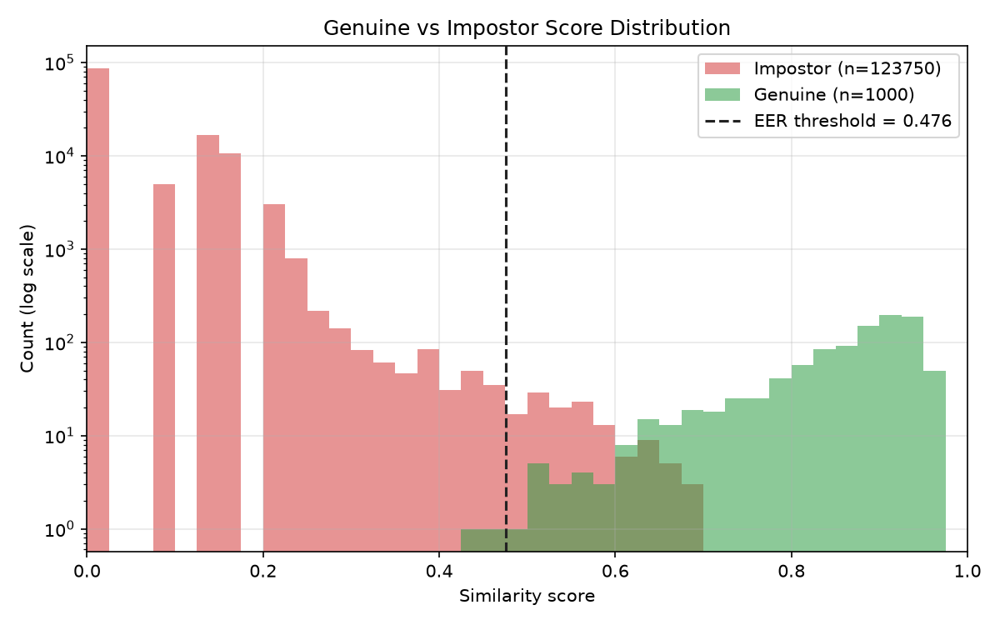
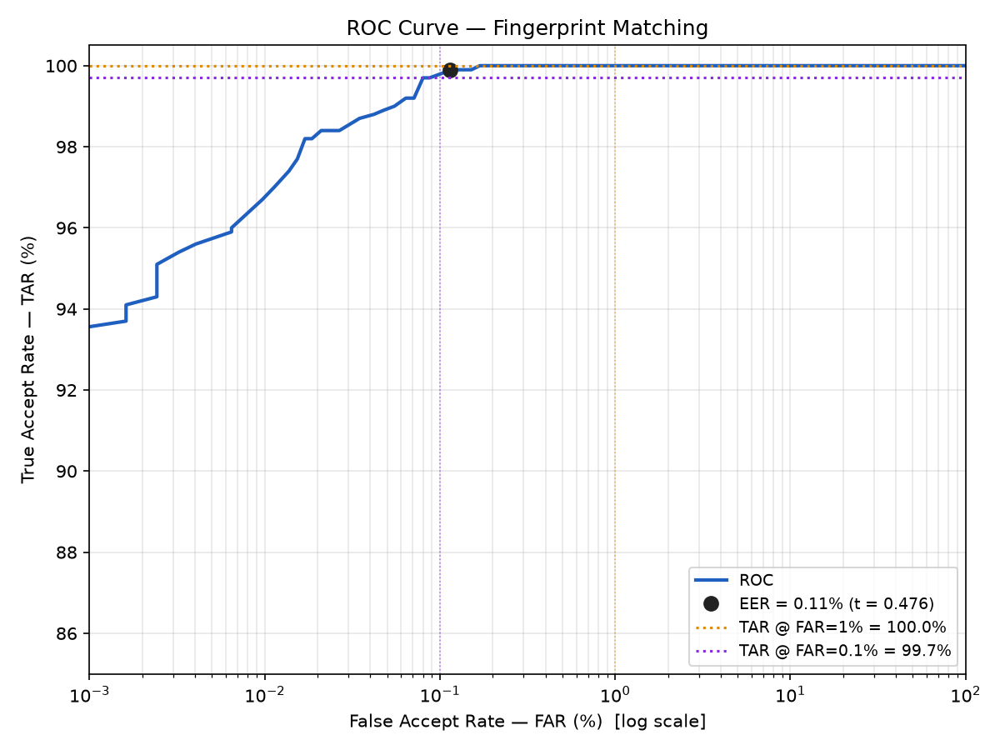
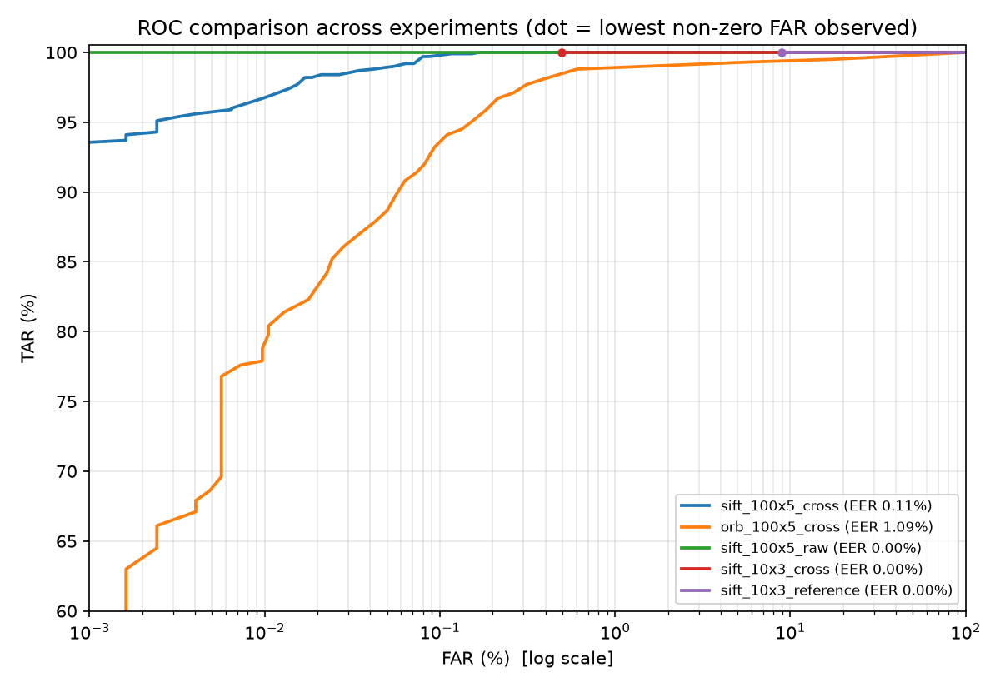

# Fingerprint Matching — Genuine/Impostor Score Collection & ROC Analysis

[](https://github.com/SKR18156592/fingerprint-roc-eval/actions/workflows/tests.yml)

An evaluation pipeline for fingerprint verification. It collects **genuine**
(same finger) and **impostor** (different fingers) match scores, builds the
**ROC curve**, and **derives the decision threshold from data**, not from a
hand-picked constant.

| Score distribution | ROC curve |
|---|---|
|  |  |

**Headline result** (SOCOFing, 100 identities × 5 captures, SIFT + RANSAC matcher,
1,000 genuine / 123,750 impostor comparisons):

| Metric | Value |
|---|---|
| EER | **0.11 %** (threshold 0.476) |
| TAR @ FAR = 1 % | 100.0 % |
| TAR @ FAR = 0.1 % | 99.7 % |
| TAR @ FAR = 0.01 % | 96.7 % (threshold 0.643) |
| Smallest measurable FAR | 0.0008 % (1 / 123,750) |

> These numbers come from synthetic re-captures of a single impression per finger, so they
> are optimistic. See [Limitations](#limitations) and the full write-up in
> [`docs/report.md`](docs/report.md) ([PDF](docs/report.pdf)).

## Experiments

| Experiment | Genuine | Impostor | EER (%) | TAR@1% | TAR@0.1% | TAR@0.01% | Min. FAR (%) |
|---|---|---|---|---|---|---|---|
| **SIFT, 100×5, cross (main)** | 1000 | 123750 | **0.11** | 100.0 | 99.7 | 96.7 | 0.0008 |
| ORB, 100×5, cross | 1000 | 123750 | 1.09 | 98.8 | 93.2 | 78.8 | 0.0008 |
| SIFT, 100×5, raw SOCOFing (no variation) | 1000 | 123750 | 0.00 | 100.0 | 100.0 | 100.0 | 0.0008 |
| SIFT, 10×3, cross | 30 | 405 | 0.00 | 100.0 | 100.0 † | 100.0 † | 0.2469 |
| SIFT, 10×3, reference | 30 | 45 | 0.00 | 100.0 † | 100.0 † | 100.0 † | 2.2222 |

† The target FAR is below 1/#impostor, so it can't be measured on that set.
Reproduce with `scripts/run_experiments.sh`.



---

## Pipeline

```
image ─► preprocess ─► keypoints ─► ratio-test matches ─► RANSAC ─► inliers ─► score
          (2x upscale,   (SIFT/ORB    (Lowe 0.8, one-to-    (similarity   n/(n+20)
           CLAHE, mask)   in mask)     one constraint)       transform)
```

1. **Preprocess** (`fpeval/preprocess.py`): 2× bicubic upscale (SOCOFing prints are
   only ~90×97 px), CLAHE contrast equalisation, and block-variance foreground
   segmentation so background noise produces no keypoints.
2. **Features** (`fpeval/matcher.py`): SIFT (default) or ORB keypoints inside the mask.
   Features are extracted **once per image** and cached.
3. **Matching**: Lowe ratio test, then a **one-to-one** constraint, then **RANSAC**
   fitting a similarity transform with a plausible scale range (0.75–1.33).
4. **Score** = `inliers / (inliers + 20)`, in [0, 1). 20 inliers scores exactly 0.5.
5. **Pairs** (`fpeval/pairs.py`): all genuine pairs, and impostor pairs under one of
   two protocols:
   - `reference`: first capture of each person only, `n(n-1)/2` pairs
   - `cross` (default): every capture against every capture, `n(n-1)/2 · k²` pairs
6. **Metrics** (`fpeval/metrics.py`): exact empirical ROC, interpolated EER,
   TAR @ FAR, and the FAR resolution the impostor set can support.

## Quick start

```bash
python -m venv .venv && source .venv/bin/activate
pip install -r requirements.txt

# 1. Download SOCOFing (Kaggle: ruizgara/socofing, public, ~880 MB)
mkdir -p data/raw
curl -L -o data/raw/socofing.zip https://www.kaggle.com/api/v1/datasets/download/ruizgara/socofing
unzip -q data/raw/socofing.zip -d data/raw/socofing

# 2. Build the gallery: data/subjects/person_XXX/capture_K.png
python scripts/prepare_socofing.py --people 100 --captures 5

# 3. Collect scores (about 6 min on a laptop for 124k comparisons)
python collect_scores.py --data data/subjects --out results/scores.json

# 4. ROC analysis: plots, summary.json, and the threshold table
python roc_analysis.py --scores results/scores.json --out-dir results

# Tests
pytest -q
```

`scripts/run_experiments.sh` reproduces every experiment in the report.
`scripts/build_report.py` renders `docs/report.md` to PDF.

### Using your own captures

Any folder laid out like this works with `collect_scores.py --data <folder>`:

```
data/subjects/
├── person_01/
│   ├── capture_1.jpg
│   ├── capture_2.jpg
│   └── capture_3.jpg
├── person_02/
...
```

## Example output

```
=== ROC Analysis Results ===
Genuine pairs:        1000
Impostor pairs:       123750
EER:                  0.11%   (threshold = 0.476)
TAR @ FAR = 1%:       100.0%   (threshold = 0.259)
TAR @ FAR = 0.1%:     99.7%   (threshold = 0.500)
TAR @ FAR = 0.01%:    96.7%   (threshold = 0.643)
Smallest measurable FAR: 0.0008%  (1/123750)
Reliable FAR floor:      0.0081%  (~10 errors needed)
EER threshold:           0.476
Recommended threshold:   0.643  (lowest threshold with FAR <= 0.01%; TAR = 96.7%, FRR = 3.3%)

Threshold | TAR (%)  | FAR (%)  | FRR (%)  | Notes
----------|----------|----------|----------|------------------
  0.20    |  100.00  |    3.81  |    0.00  |
  0.30    |  100.00  |    0.42  |    0.00  |
  0.40    |  100.00  |    0.19  |    0.00  | (hand-picked baseline)
  EER pt  |   99.80  |    0.10  |    0.20  | <- EER (t = 0.476)
  0.50    |   99.70  |    0.09  |    0.30  |
  0.60    |   98.40  |    0.02  |    1.60  |
  0.70    |   92.70  |    0.00  |    7.30  |
  0.80    |   81.80  |    0.00  |   18.20  |
```

## Project layout

```
fpeval/
  dataset.py      folder-per-identity gallery loader
  preprocess.py   upscale, CLAHE, foreground mask
  matcher.py      SIFT / ORB + ratio test + one-to-one + RANSAC → score
  pairs.py        genuine / impostor pair generation (+ closed-form counts)
  metrics.py      FAR, FRR, ROC, EER, TAR@FAR, FAR resolution
  plots.py        histogram + ROC figures
collect_scores.py   images → scores.json
roc_analysis.py     scores.json → plots, summary.json, threshold table
scripts/            dataset builder, experiment runner, figures, report builder
tests/              pytest suite (metrics, pair counts, matcher behaviour)
results/            committed scores and plots for the main experiment
docs/report.md      methodology, results, discussion
```

## Limitations

- **SOCOFing has one real impression per finger.** The other "captures" are
  synthetic alterations (obliteration, central rotation, z-cut) of that same
  image. I add random rotation, translation, blur, noise and partial occlusion
  to approximate separate placements, but real re-captures also differ in skin
  elasticity, pressure and moisture. Expect the EER on real data to be higher.
- Contact-scanner images at roughly 500 dpi. Contactless phone captures add
  perspective distortion, uneven lighting and a domain gap that this pipeline
  does not model.
- The keypoint matcher is a general-purpose vision baseline, not a minutiae
  matcher (e.g. NIST Bozorth3 or SourceAFIS). The evaluation code works with
  any matcher that returns a similarity score.

## License

MIT
