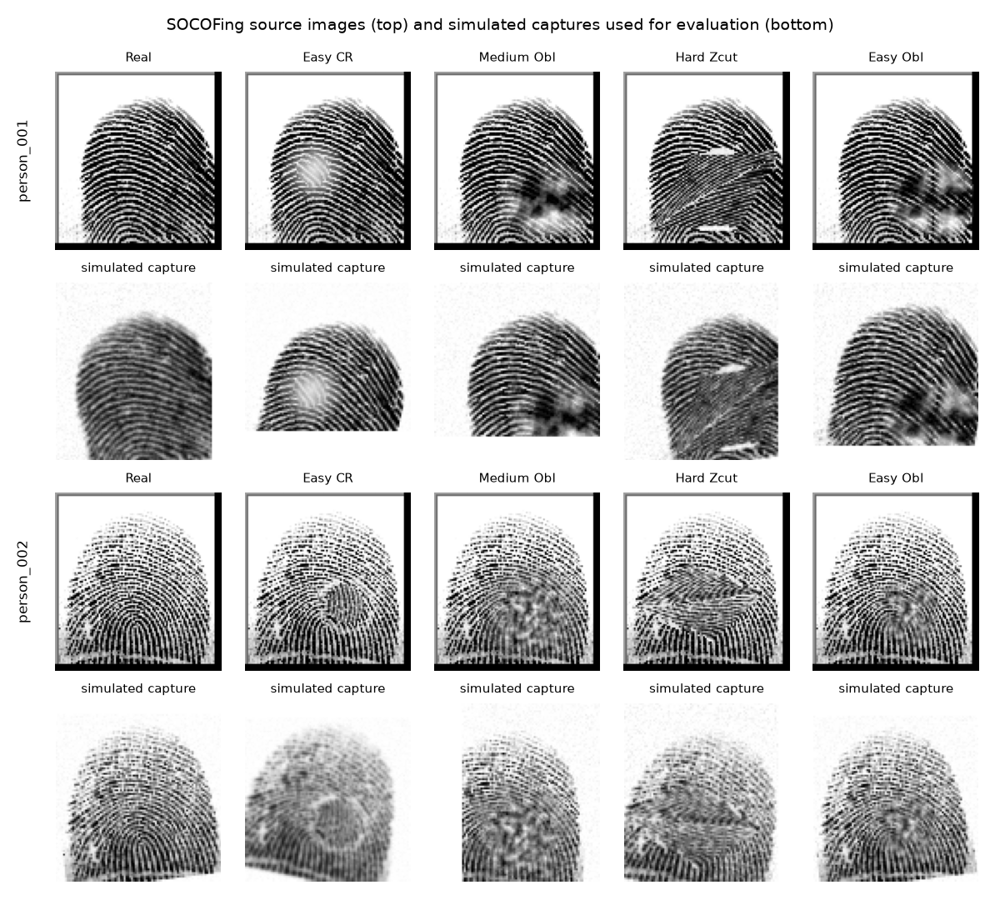

# Data-Driven Threshold Selection for Fingerprint Verification

**Suman Raj** · Genuine/impostor score collection, ROC analysis and operating-point selection · Code: this repository

## 1. Goal and setup

A verification threshold chosen by hand (for example 0.40) says nothing about how often the system accepts an impostor or rejects a genuine user. This project measures those rates directly. It collects similarity scores for genuine pairs (same finger) and impostor pairs (different fingers), builds the empirical ROC, and picks the threshold that meets a stated false-accept target.

**Data: SOCOFing** (Kaggle, 600 subjects × 10 fingers, contact scanner, ~90×97 px after cropping). One right index finger per subject, so every identity is a different person. **100 identities × 5 captures.** SOCOFing has only one real impression per finger. The other captures are its synthetic alterations (Easy-CR, Medium-Obl, Hard-Zcut, Easy-Obl). These are pixel-identical to the original outside the altered patch, so I add independent random *acquisition variation* to every capture: ±15° rotation, ±6 px shift, ±5 % scale, blur, sensor noise, and up to 20 % occlusion from one side. I also crop the fixed 2–4 px scanner frame. Before that crop, its corners produced matching keypoints in images of *different* people.

**Matcher.** 2× upscale → CLAHE → block-variance foreground mask → SIFT keypoints in the mask → Lowe ratio test (0.8) → one-to-one constraint → RANSAC similarity transform (scale 0.75–1.33) → score = inliers / (inliers + 20). Two bugs found during development are worth noting:

- **Many-to-one matches.** Without the one-to-one constraint, repetitive ridge texture let many keypoints match one target point. RANSAC then fit a *collapsed* transform, and some impostor pairs reached 200 inliers.
- **Score normalisation.** Normalising inliers by keypoint count made the score depend on image noise. A saturating map of the raw inlier count gave a lower EER.

## 2. Pair counts

With *n* identities and *k* captures each:

- **Genuine:** n · k(k−1)/2 = 100 × (5×4/2) = **1,000**
- **Impostor, "reference" protocol** (one capture per person): n(n−1)/2 = 100×99/2 = 4,950
- **Impostor, "cross" protocol** (every capture vs every capture, used here): n(n−1)/2 · k² = 4,950 × 25 = **123,750**

For the minimal 10 × 3 gallery: 10 × 3 = 30 genuine pairs, and 45 (reference) or 405 (cross) impostor pairs. The cross protocol uses comparisons the data already contains. That matters because the impostor count sets the smallest FAR you can measure.

## 3. Results

 

| Experiment | Genuine | Impostor | EER (%) | TAR@1% | TAR@0.1% | TAR@0.01% | Min. FAR (%) |
|---|---|---|---|---|---|---|---|
| **SIFT, 100×5, cross (main)** | 1000 | 123750 | **0.11** | 100.0 | 99.7 | 96.7 | 0.0008 |
| ORB, 100×5, cross | 1000 | 123750 | 1.09 | 98.8 | 93.2 | 78.8 | 0.0008 |
| SIFT, 100×5, raw SOCOFing (no variation) | 1000 | 123750 | 0.00 | 100.0 | 100.0 | 100.0 | 0.0008 |
| SIFT, 10×3, cross | 30 | 405 | 0.00 | 100.0 | 100.0 † | 100.0 † | 0.2469 |
| SIFT, 10×3, reference | 30 | 45 | 0.00 | 100.0 † | 100.0 † | 100.0 † | 2.2222 |

† Target FAR is below 1/#impostor, so it is not measurable on that set.

| Threshold | TAR (%) | FAR (%) | FRR (%) | False accepts / 123,750 | Notes |
|---|---|---|---|---|---|
| 0.30 | 100.00 | 0.42 | 0.00 | 514 | |
| 0.40 | 100.00 | 0.19 | 0.00 | 240 | hand-picked baseline |
| **0.476** | 99.80 | 0.10 | 0.20 | 125 | **EER point** |
| 0.50 | 99.70 | 0.09 | 0.30 | 108 | |
| **0.643** | 96.70 | 0.0065 | 3.30 | 8 | **recommended (FAR ≤ 0.01 %)** |
| 0.70 | 92.70 | 0.00 | 7.30 | 0 | |

Takeaways:

- SIFT is about 10× better than ORB at the EER, and far better at low FAR (96.7 % vs 78.8 % TAR at FAR 0.01 %).
- The raw dataset separates perfectly. That is why the simulated variation is needed to get any meaningful number.
- Matching costs about 2.8 ms per comparison on a laptop CPU.

## 4. Discussion

**What the EER means.** An EER of 0.11 % means there is a threshold (0.476) at which roughly **1 in 900 impostor attempts is wrongly accepted** and roughly **1 in 900 genuine attempts is wrongly rejected**. On this data that threshold accepted 125 of 123,750 impostor pairs and rejected 2 of 1,000 genuine pairs. It is the single number where both kinds of mistake are equally common, which makes it a convenient way to compare matchers. It is *not* a sensible production setting, because the two errors do not cost the same.

**Smallest FAR measurable with 10 people × 3 captures.**

- With the 45 reference impostor pairs, one false accept is already 1/45 = **2.2 %**. Nothing smaller can be observed.
- If zero false accepts are seen, the 95 % upper bound on the true FAR is still 3/45 = **6.7 %** ("rule of three").
- A *reliable* estimate needs about 10 errors, which puts the floor at 10/45 = **22 %**.
- Even with all 405 cross pairs, the smallest observable FAR is 0.25 %.

The 10 × 3 runs report "EER 0 %", but that means the matcher made no error in 75 comparisons, not that it is perfect.

**Why report EER for small sets instead of TAR @ FAR = 0.01 %.** Measuring FAR = 10^-4 (0.01 %) needs about 10 observed false accepts, so about 100,000 impostor pairs. With 45 pairs, TAR @ FAR 0.01 % is just TAR at a threshold above every impostor score. That is an extrapolation, not a measurement. The EER sits where errors are frequent enough to observe, so even a small set can estimate it.

The main experiment's 123,750 pairs barely reach this regime. At the recommended threshold I observe 8 false accepts, just under the ~10-error guideline. The pairs are also not fully independent, since five captures of one person are correlated. The 0.01 % figure should therefore be read as an approximate estimate.

**Overlap.** The distributions overlap in a thin band from 0.43 to 0.70:

- 7.3 % of genuine scores fall below the highest impostor score.
- 0.17 % of impostor scores (209) rise above the lowest genuine score.

So no threshold gives zero errors. Raising the threshold to protect against impostors in that band necessarily rejects some genuine users. On real repeat captures this band will be wider, because real placements differ in pressure, moisture and skin elasticity.

**Recommended threshold: 0.643 (FAR ≤ 0.01 %, FRR 3.3 %).**

- Verification is a security decision, so the threshold should be fixed by the false-accept rate the application can tolerate, not by the EER.
- The hand-picked 0.40 accepts **240 impostors** on this data, about 30× more than 0.643 (8). A rejected genuine user can simply retry.
- If a 3.3 % first-attempt rejection is too high, 0.60 lowers FRR to 1.6 % at FAR 0.02 %.
- This number is specific to this matcher and data. It must be recalibrated on real captures (ideally 450+ users for FAR 10^-4), and recalibrated again whenever the matcher, the preprocessing or the capture device changes.

## 5. Limitations and next steps

- SOCOFing contains no real re-captures. The next step is to evaluate on real repeat captures, such as phone-camera images or a multi-impression set like FVC.
- Contact scanner images. Contactless captures add perspective distortion and lighting variation that this pipeline does not model.
- Replace or fuse the keypoint matcher with a minutiae matcher (NIST Bozorth3, SourceAFIS) and compare them on the same pipeline.
- Report confidence intervals: bootstrap over *identities* rather than pairs, to account for correlated captures.
